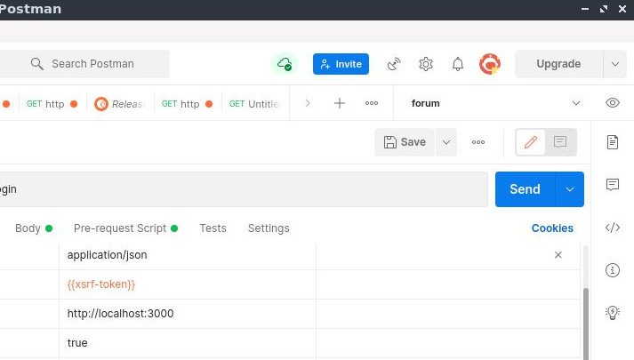
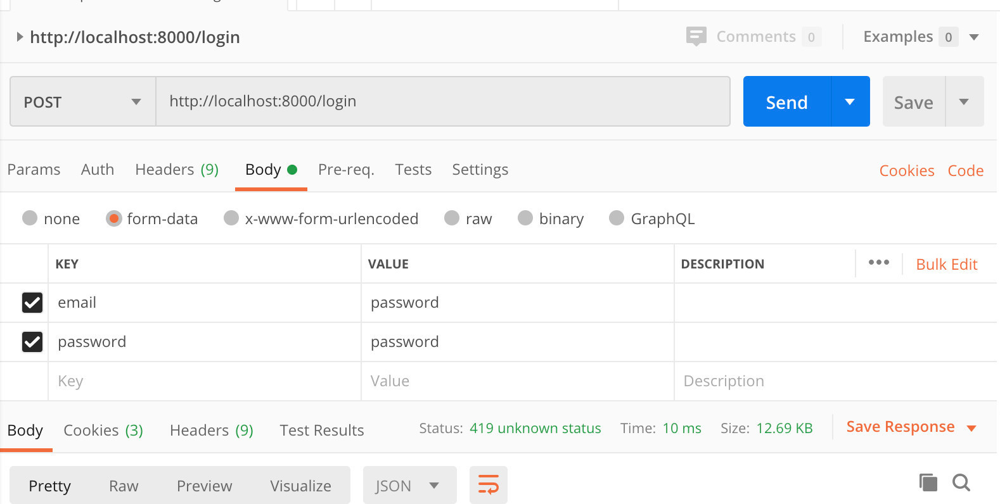
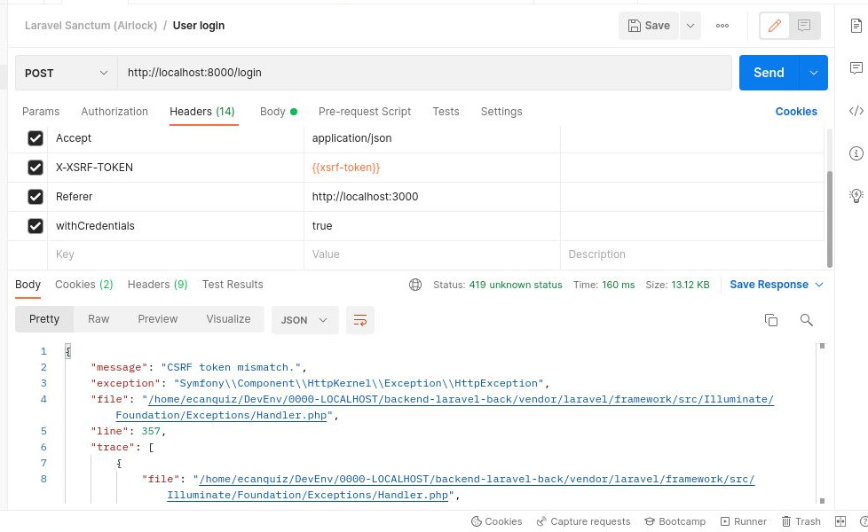

# Laravel Sanctum (Airlock) con Postman

:::info Prueba
Esta lección en [idioma original](https://blog.codecourse.com/laravel-sanctum-airlock-with-postman/)
:::

Recuerda que estás usando Laravel como una API. Y para probarlo con Postman, esto requiere un poco más de trabajo que simplemente adjuntar un token (a menos que esté utilizando autenticación basada en token con Sanctum).

Si está creando un SPA y quiere probar sus terminales con autenticación basada en cookies en Postman, aquí le mostramos cómo hacerlo.

## La esencia de esto

Debido a que Sanctum utiliza la autenticación basada en cookies y llega a puntos finales protegidos por CSRF como `/login` y `/logout`, debemos asegurarnos de que estamos enviando un token CSRF con Postman. Obtenemos esto enviando una solicitud a `/sanctum/csrf-cookie` primero. También tendremos que asegurarnos de que el `Referrer` se envíe correctamente para futuras solicitudes de Sanctum para permitirlos.

Estamos probando esto con un [Proyecto Laravel correctamente configurado con Sanctum](../laravel-11/setup-laravel-api.html#), que permite solicitudes de localhost, en términos de dominios CORS y Sanctum.

## Crear una Colección de Postman

Recomendamos crear una colección de Postman para que podamos aplicar nuestro script de solicitud previa (en un momento) a todos los puntos finales.


Una vez que se crea la colección, esto facilita la aplicación de un script de solicitud previa a todos los puntos finales de esa colección. También ayuda a mantener todo limpio y ordenado.

## Crea un ambiente

Vamos a configurar un token CSRF en nuestras variables de entorno en Postman, por lo que debemos crear un entorno de Postman.

Haga clic en la rueda dentada en la parte superior derecha de Postman, haga clic en Agregar y asigne un nombre a su entorno (el mío `Api-test`). Haga clic en Agregar nuevamente y cambie a su entorno en la parte superior derecha (vea la parte superior derecha de la captura de pantalla).



## Agregar un script de solicitud previa

Antes de realizar alguna solicitud, cree una nueva solicitud para `/login` en Postman, guárdela en su colección y agregue los datos del formulario (email y password).



Pero, antes agregue un encabezado `Accept` con `application/json` también, para recuperar JSON.



No es de extrañar aquí, recibimos un error de discrepancia de token CSRF.

Entonces, agreguemos ese `Pre-request Scripts` para tomar el token CSRF usando Sanctum, configurando el valor en nuestras variables de entorno de Postman.

Edite su colección y cambie a la pestaña `Pre-request Scripts` y agregue lo siguiente.


No lo escriba desde la captura de pantalla, cópielo desde aquí:

```js
pm.sendRequest({
    url: 'http://localhost:8000/sanctum/csrf-cookie',
    method: 'GET'
}, function (error, response, { cookies }) {
    if (!error) {
        pm.environment.set('xsrf-token', cookies.get('XSRF-TOKEN'))
    }
})
```

Haz click en `Save` y eso se guardará.

Ahora haga otra solicitud a `/login`. Esta vez, se ejecutará `Pre-request Scripts` y establecerá la cookie que obtenemos del punto final `/sanctum/csrf-cookie` en nuestro entorno.

Presiona el ícono del ojo en la parte superior derecha para verificar.


Genial, ese es nuestro valor de token CSRF.

Ahora actualice la solicitud `/login` para agregar el encabezado `X-XSRF-TOKEN` con el valor:

__{ { xsrf - token } }__

(este es el valor de nuestra variable de entorno) y envíe la solicitud nuevamente.


Asegúrese de no incluir espacios entre las llaves (por ejemplo, __{ { xsrf - token } }__). A Postman no le gusta eso.

Espero que eso haya funcionado para ti. De lo contrario, es posible que deba verificar la configuración de Sanctum.

## Hacer solicitudes autenticadas

Así que hemos ordenado CSRF, ahora haremos una solicitud a `/api/users` para verificar que realmente estamos autenticados. Cree una solicitud para esto en Postman y agréguelo a su colección. Y por supuesto, enviar esa solicitud.


Hmm, no autenticado.

Ahora, esto debería funcionar. Postman ha almacenado las cookies que obtuvimos al realizar la solicitud anterior a `/login` y las enviará junto con esta solicitud. Puede verificar esto haciendo click en el enlace de cookies en la parte superior derecha de su solicitud.


La razón por la que esto no funciona es que Sanctum está denegando la solicitud autenticada en función al `Referrer`.

Si está interesado en sumergirse en algún código de Sanctum y averiguar por qué, abra el middleware de `GuaranteeFrontendRequestsAreStateful` y compruebe el método `fromFrontend` por el que se canalizan todas las solicitudes.

```php
public static function fromFrontend($request)
{
    $referer = Str::replaceFirst('https://', '', $request->headers->get('referer'));

    $referer = Str::replaceFirst('http://', '', $referer);

    return Str::startsWith($referer, config('sanctum.stateful', [])) ||
            Str::is(config('sanctum.stateful', []), $referer);
}
```

¡Está comprobando el `Referrer`!

Por el momento en Postman, esto no está bien configurado, así que agréguelo a su lista de encabezados y envíe la solicitud nuevamente. 


Y listo, una solicitud exitosa a un punto final autenticado.

Es mejor en este punto guardar su dominio en una variable de entorno en Postman. Si esto cambia y tiene muchos puntos finales, será una pesadilla actualizarlo.

Haga click en el engranaje en la parte superior derecha, seleccione su entorno y agregue manualmente su host.


Una vez que haya guardado eso, cambie el valor del encabezado y envíe la solicitud nuevamente.


Todavía funciona. Excelente.

Deberá agregar el encabezado `Referrer` a todas las solicitudes que realice a su API, si están protegidas con Sanctum. Sin embargo, eso no es demasiado problema.

## Una nota rápida sobre otras rutas web

Sanctum nos permite usar la ruta web normal `/login` para autenticarnos, pero eso no es todo. También podemos pulsar `/logout` para invalidar el valor de la cookie autenticada.

Para estas otras rutas web (también protegidas por CSRF), debe asegurarse de que también está enviando el token. Aquí hay un ejemplo rápido.


Mi solicitud para `/logout` fue exitosa porque estoy enviando el encabezado `X-XSRF-TOKEN`, al igual que lo hicimos para `/login`.
